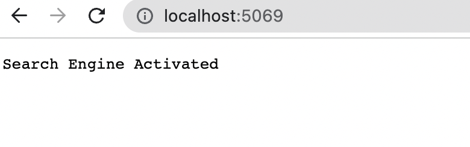
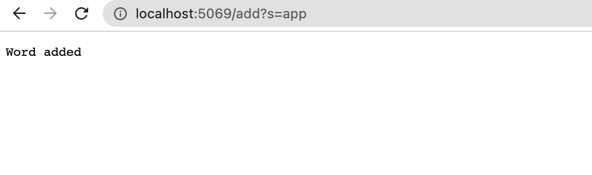
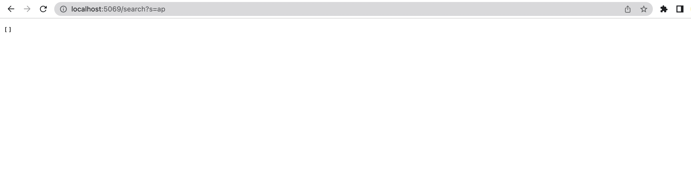
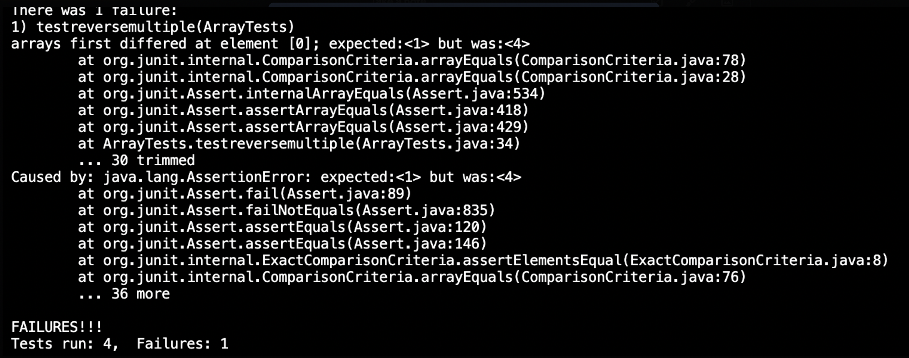

# Lab3

```
Part 1:
```


     import java.io.IOException;
     import java.net.URI;
     import java.util.ArrayList;
     import java.util.Arrays;

      class Handler implements URLHandler {
        // The one bit of state on the server: a number that will be manipulated by
        // various requests.
        ArrayList<String> words = new ArrayList<String>();
        ArrayList<String> lookup = new ArrayList<String>();

        public String handleRequest(URI url) {
  
           words.clear();
           lookup.clear();

           if (url.getPath().equals("/")) {
               return String.format("Search Engine Activated");

            } else {
               System.out.println("Path: " + url.getPath());
               if (url.getPath().contains("/add")) {
                    String[] parameters = url.getQuery().split("=");
                    words.add(parameters[1]);
                       return String.format("Word added", parameters[1]);

               }
               if (url.getPath().contains("/search")) {
                 String[] parameters = url.getQuery().split("=");

                     for (int i = 0; i < words.size(); i++) {
                         if (words.get(i).contains(parameters[1])) {
                            lookup.add(words.get(i));
                         }
                      }
                      return String.format(Arrays.toString(lookup.toArray()));

                 }
              }
              return "404 Not Found!";
           }
       }


        class SearchEngine {
           public static void main(String[] args) throws IOException {
               if(args.length == 0){
               System.out.println("Missing port number, try any number between 1024 to 49151");
               return;
            }
            int val = Integer.parseInt(args[0]);
          Server.start(val, new Handler());
       }
     }

Which methods in your code are called
What the values of the relevant arguments to those methods are, and the values of any relevant fields of the class
If those values change, how they change by the time the request is done processing




In this screenshot, I have the server being started giving us the link, "http://localhost:5069" in the terminal. The first method in my code that is being called is handleRequest and the argument "URI url". The url is the localhost:5069 link that was provided in the terminal. This particular screenshot was made when it was reading the line, and determining if there is the "/" it will print out "Search Engine Activated". The link is empty and doesn't have anything but the server with the server number I had chosen in the terminal. If the URL link were to change values, like "/add?s" or "/search?s" it would create different outputs depending on the input, in less than seconds.



In this screenshot, the server was already started and running. The method that was called was handleRequest and the argument url link was "http://localhost:5069/add?s=app". There was a / detected in the link which switched to the else statement. The program found the key word value "add" which passed the first else statement. The values being called or changed are, "=" because it split the weblink into 2 at the equal sign, then it added that the string word after the equal sign it, adds it to a query. If the value were to change whether it detects add or another word, it goes through a different else statement until it finds the corect keyword found or returns "404 not found"


In this screenshot, although my code doesn't not do the correct thing, the server is supposed to be searching up the strings in the new value to see if they are in the the query to be able to return those strings with the letters or phrases. The method is handleRequest and the argument url link was "http://localhost:5069/search?s=ap". Just like the previous screenshot with ADD, the search it being handled the same way except it is being replaced by search. If the values were to change, the same thing as the previous description would happen where it would go to the next step and then the next until i either finds the correct program or it returns a "404 not found". 


```
Part 2:
```

The failure-inducing input (the code of the test)
The symptom (the failing test output)
The bug (the code fix needed)
Then, explain the connection between the symptom and the bug. Why does the bug cause that particular symptom for that particular input?

The two of bugs were ReverseInPlace in ArrayExamples.java and 

With ReverseInPlace the failure-inducing input was:

' static void reverseInPlace(int[] arr) {
    for(int i = 0; i < arr.length; i += 1) {
      arr[i] = arr[arr.length - i - 1];
    }
'   
    


The bug and the symptom is that reversedInPlace's modification of the array it was reading from, was creating a mirrored array instead of actually reversing the elements in place. 


What needed to be fix was a temporary variable where the elements needed to placed in, where it wouldn't have gotten replaced by the last element and just mirrored itself. 
